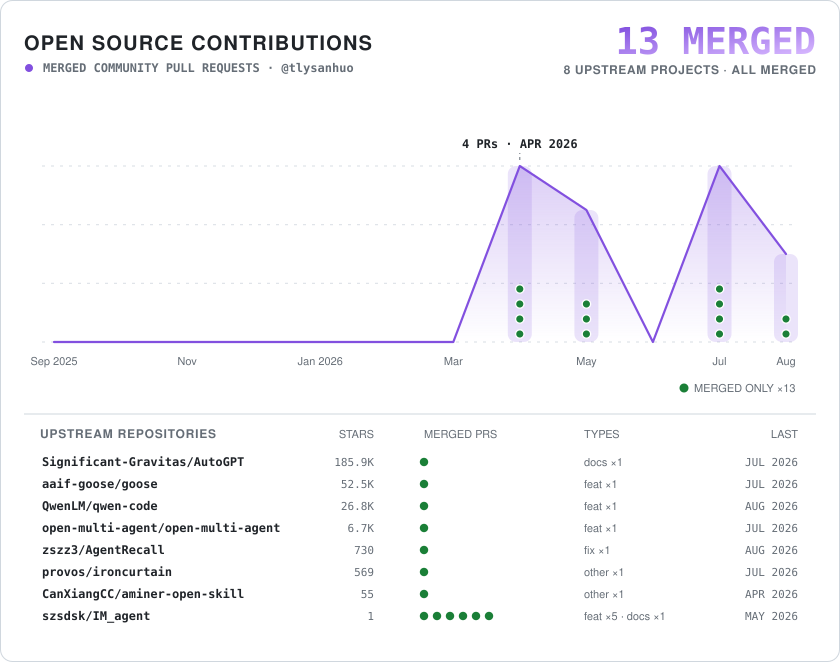

# Hi, I'm Sanhuo 👋

Student @ BIT · Building practical AI agents and research tools.

<!-- profile-readme -->

  <a href="https://github.com/search?q=author%3Atlysanhuo+-user%3Atlysanhuo&type=pullrequests">
    <picture>
      <source media="(prefers-color-scheme: dark)" srcset="./assets/oss-contributions-dark.svg">
      <source media="(prefers-color-scheme: light)" srcset="./assets/oss-contributions-light.svg">
      
    </picture>
  </a>

